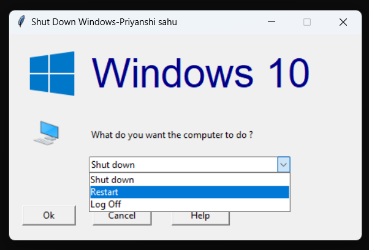

# 🖥️ Windows Shutdown Utility

A GUI-based Windows Shutdown Utility built with Python and Tkinter that replicates the Windows shutdown dialog.

## 📸 Screenshot



## ✨ Features

- Shut down the computer
- Restart the computer
- Log off the current user
- Simple Windows-inspired interface

## ⚠️ Windows Only

This application uses Windows `shutdown` commands and **only works on Microsoft Windows**.

## 📁 Required Files

Make sure these files are kept in the same folder as the Python script:

- `This PC.png`
- `Windows.png`

These images are required for the application's interface.

## 🛠️ Built With

- Python
- Tkinter

## 🚀 How to Run

```bash
python shutdown_utility.py
```

> **Warning:** This application executes real Windows shutdown commands. Save any important work before using the Shut Down or Restart options.

## 📄 License

This project is licensed under the MIT License.
